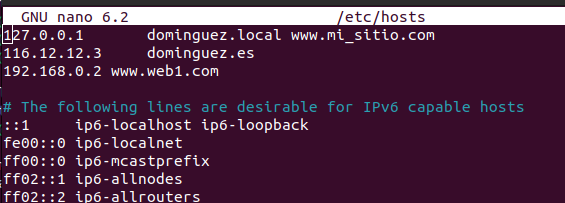

# Práctica 1 Servicios web

Configuración de servidores web con Apache y Nginx

Es una práctica, no un examen. Estoy para resolver dudas y para ayudar.

## Objetivos

- Configurar host virtuales en Apache
- Configurar host virtuales en Nginx
- Configurar certificados SSL autofirmados
- Configurar HTTPS
- Configurar proxy inverso

## Punto de partida

- **Máquinas**. Vamos a usar máquinas definidas por el profesor mediante despliegues:
  - *Weberver*. Servidor creado para la práctica. Ya tiene instalado apache y nginx
  - *Cliente Ubuntu*. El usado en clase hasta el momento
- **Tarjeas de red**. 
  - El cliente va a usar su tarjeta **enp4s0**. Con la ip que tiene 192.168.x.100
  - El servidor web está conectado a la red personal como el cliente con la tarjeta **enp3s0**. Viene con una IP estática 192.168.0.2. Debéis cambiar el tercer dígito para que se adapte a vuestra red: 192.168.x.2.


## Sitios web

Vamos a configurar 4 sitios web

- www.web1.com, alojado en /var/www/web1. Con fichero de inicio index.html
- www.web2.com, alojado en /var/www/web2. Con fichero de inicio index.html
- www.web3.com, alojado en /var/www/web3. Con fichero de inicio index.html
- www.web4.com, alojado en /var/www/web4. Con fichero de inicio index.html

Debes crear las  correspondientes carpetas web y sus ficheros de inicio. Cada index.html debe contener un mensaje con el nombre del sitio y con el tuyo propio. Algo así:

```html
<h1>Web1</h1>
Rafael Cabeza (pon tu nombre)
```

Debes configurar tu fichero hosts en el cliente para poder conectarte a ellos.

## Sitio 1

- Servidor Apache
- Puerto 80.




## Sitio 2

- Servidor Apache
- Puerto 80.


## Sitio 3

- Servidor Apache
- Puerto 80.
- Configura conexión **https** y protocolo **http/2**


## Sitio 4

- Servidor nginx
- Puerto 8000
- Recuerda que se activa con `ln -s /ruta/absoluta /etc/nginx/sites-enabled`


## Proxy nginx

- Configura un fichero de hostvirtual llamado proxy
- Agrega dos bloques "location" para hacer de proxy inverso de los sitios web2 y web3:
  - Puerto 8000
  - server_name `www.web2.com` y `www.web3.com` respectivamente
  - Bloque location:

  ```nginx
  location / {
      proxy_pass http://www.webX.com;
      proxy_set_header Host $host;
      proxy_set_header X-Real-IP $remote_addr;
  }
  ```
