# Práctica 1

# Configuración del Ubuntu Server.

Con este comando se cambia el nombre de ubuntu a server05
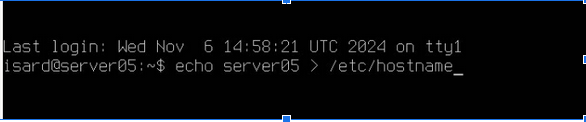

Configura tu tarjeta de red usando la dirección 192.168.X.1/24.

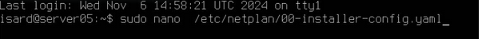
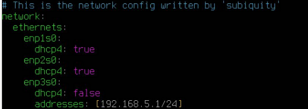

Con este comando guardamos los cambios

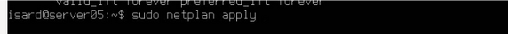

Aquí podemos ver como se ha actualizado

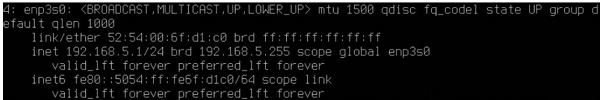

# Configuración del Cliente Ubuntu

Busca el diálogo de configuración y cambia el nombre del equipo a ubuntuXX

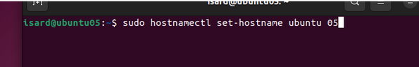

sudo nano /etc/hosts

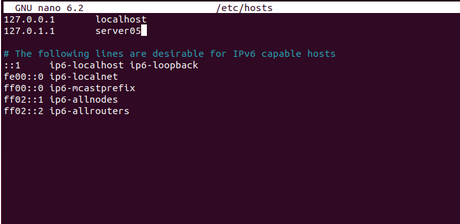

Busca el diálogo de configuración (windows + red) y cambia la configuración de red usando la dirección 192.168.X.2/24

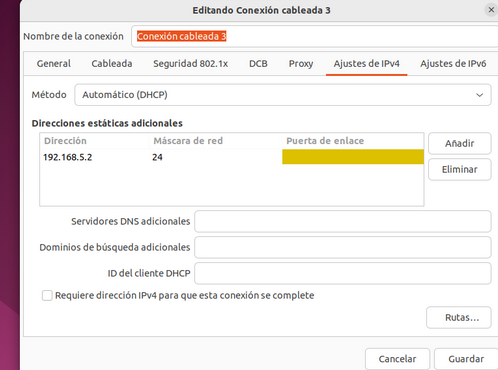

Comprueba que la IP se ha actualizado con el comando ip a

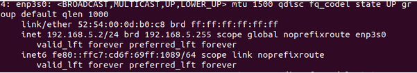
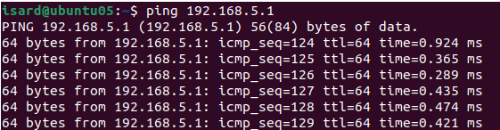

# Configuración del Cliente Windows 10

Busca el diálogo de configuración y cambia el nombre del equipo a windowsXX

Para cambiarlo tienes que entrar en configuración-sistema-acerca de-cambiar nombre del equipo

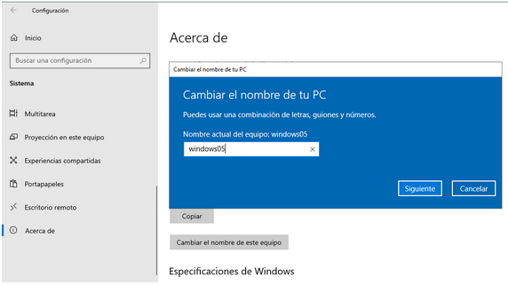

Busca el diálogo de configuración (windows + conexiones) y cambia la configuración de red usando la dirección 192.168.X.2/24

Para cambiar la configuración tienes que ir a configuración-red e internet-ethernet-cambiar opciones del adaptador de red. Entramos en la red que se está utilizando y le damos a propiedades. Ahí vamos a Protocolo de internet versión 4 y a su propiedades y ponemos nuestra ip.

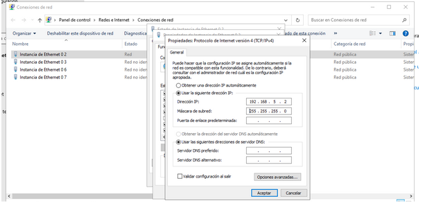

Comprueba que la IP se ha actualizado con el comando ipconfig. Para cambiar el nombre en Windows: botón derecho sobre icono de equipo.

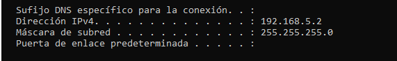

# Configuración DHCP en Ubuntu Server

Añade una tarjeta de red a tus 3 máquinas asociadas a la red Personal 1 (Hecho por el profesor). En las máquinas línux se etiquetará como enp4s0.
Vas a utilizar la dirección de red: 192.168.1XX.0/24, donde XX debes sustituirlo por tu número de alumno

sudo nano /etc/default/isc-dhcp-server

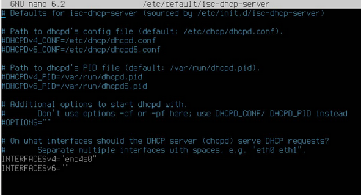
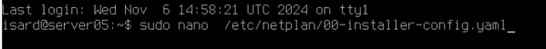 
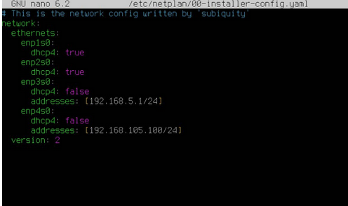

Configura el servidor DHCP. Debes definir un rango desde la IP 192.168.XX.100 hasta la 192.168.XX.200.

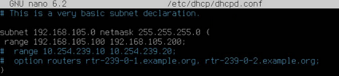

Comprueba la dirección obtenida y la conexión mediante ping.

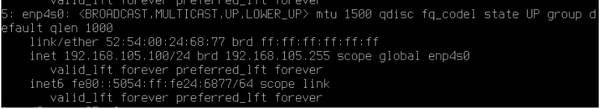

Verifica las leases o préstamos del servidor (dhcp-lease-list y /var/lib/dhcp/dhcpd.leases_)

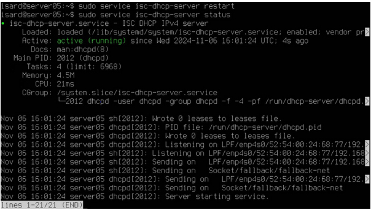

Configura una reserva de IP fija en el servidor DHCP. Por ejemplo la dirección 50.

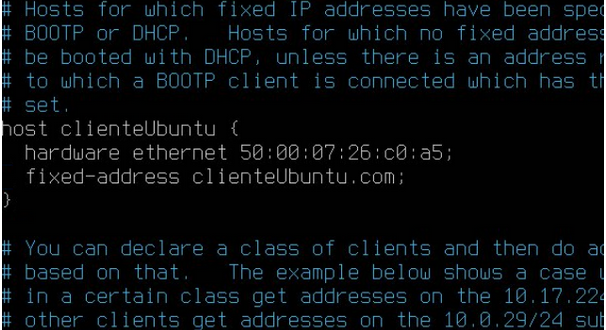

Reinicia el servicio, y renueva la IP en windows. Verifica que la nueva configuración toma efecto.

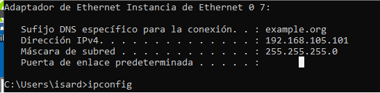
